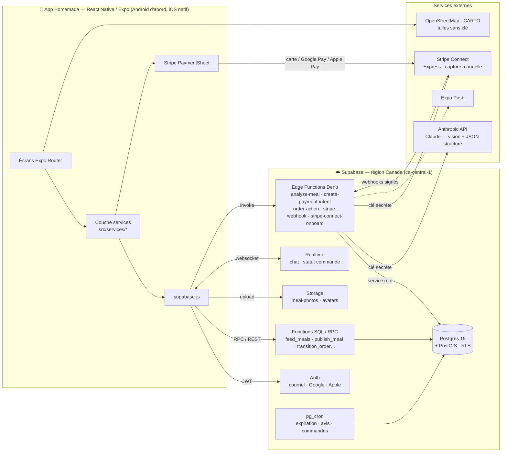
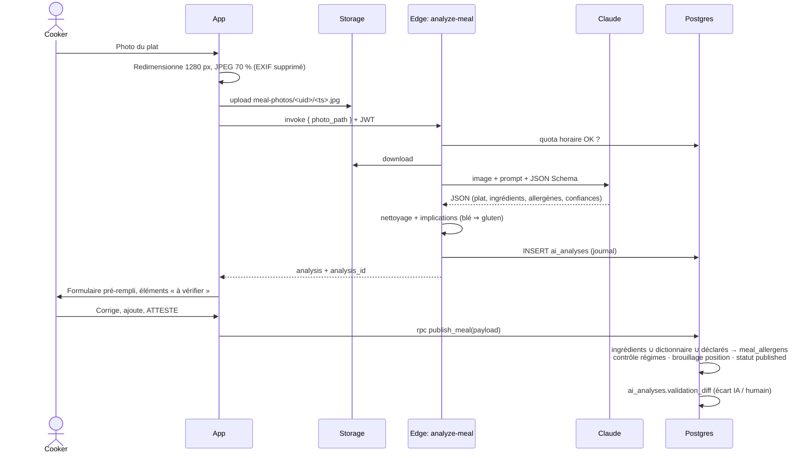
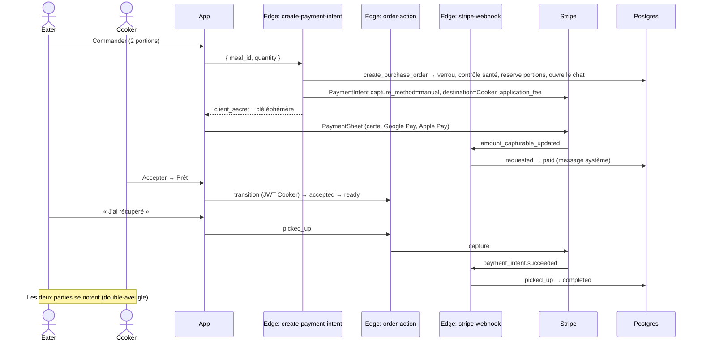

# 1. Architecture globale

## Vue d'ensemble



**Règle structurante : l'app ne détient aucun secret.** Elle ne connaît que l'URL Supabase, la clé *anon* et la clé *publiable* Stripe. Les clés Anthropic, Stripe secrète et *service role* ne vivent que dans les Edge Functions.

## Choix techniques et justification

| Besoin | Choix | Pourquoi |
|---|---|---|
| Front-end | **React Native + Expo SDK 57**, Expo Router, TypeScript strict | Un seul code Android/iOS, OTA updates (EAS Update), écosystème mature. Compatible Expo Go pour le prototypage (mode démo). |
| Back-end / BaaS | **Supabase** (plutôt que Firebase) | Le cœur du produit est **relationnel et géographique** : croiser allergènes × ingrédients × profils, filtrer par distance, noter dans les deux sens. Postgres + PostGIS le fait **dans une seule requête côté serveur** avec des garanties transactionnelles. Firestore n'a ni jointure, ni requête « ne contient aucun de », ni géo-requête native : le filtrage allergènes devrait se faire côté client — inacceptable pour la sécurité. La RLS de Postgres donne une autorisation au niveau ligne *et* colonne. |
| Comptes | **Supabase Auth** | Courriel/mot de passe dès le MVP, Google et Apple Sign-In en phase 2 (Apple obligatoire sur iOS si un autre login social est offert). Le trigger `handle_new_user` crée profil, données privées et réglages. |
| IA visuelle | **Claude (Anthropic API) — `claude-opus-5`** via Edge Function | Voir comparatif ci-dessous. |
| Paiement | **Stripe Connect Express** + PaymentSheet | Marketplace à deux côtés : Stripe gère le KYC des Cookers, les virements, les litiges. *Destination charges* + `application_fee_amount` pour la commission. **Capture manuelle** : l'Eater est pré-autorisé à la commande, débité à la cueillette. |
| Carte | **Leaflet + OpenStreetMap** (fond CARTO Voyager) dans une WebView (`react-native-webview`) | **Aucune clé ni facturation** (Google Maps exige une clé dans l'APK) ; même rendu dans Expo Go, l'APK et l'aperçu web ; pastilles de prix en HTML, sélecteur de point de cueillette. Leaflet est chargé depuis le CDN avec empreinte SRI ; hors ligne, repli automatique sur la liste par distance. |
| Temps réel | **Supabase Realtime** | Chat et suivi de commande sans serveur WebSocket à maintenir ; la RLS filtre les événements. |

### Quelle IA pour la reconnaissance des plats ?

| Option | Ce qu'elle sait faire | Limites pour Homemade | Verdict |
|---|---|---|---|
| Google Cloud Vision (labels) | Étiquettes génériques (« food », « pasta », « salad ») | Aucune liste d'ingrédients, aucun raisonnement sur les allergènes cachés (beurre dans une sauce, soya dans une marinade). Il faudrait construire toute la logique au-dessus. | ❌ Insuffisant seul |
| Modèles spécialisés (Clarifai Food, LogMeal, Passio) | Reconnaissance de plats, parfois nutrition | Catalogues orientés restauration/US, peu de raisonnement « recette maison », intégration et coût par appel variables, français limité. | ⚠️ Possible en complément |
| **LLM multimodal (Claude, GPT, Gemini)** | Identifie le plat, **déduit les ingrédients non visibles** d'après la recette typique, raisonne sur les allergènes, répond en français, **sortie JSON contrainte par un schéma** | Coût par appel plus élevé qu'une API de labels ; latence de quelques secondes. | ✅ **Recommandé** |

**Recommandation : un LLM multimodal appelé côté serveur, avec sortie structurée.** L'implémentation utilise **Claude** (`claude-opus-5`, SDK officiel `@anthropic-ai/sdk`) :

- **Sorties structurées** (`output_config.format` + JSON Schema) : les codes d'allergènes sont une énumération fermée — le modèle ne peut pas inventer un code.
- **Raisonnement adaptatif** (`thinking: adaptive`) et effort réglable (`AI_EFFORT`) pour arbitrer latence / rigueur.
- **Repli automatique côté serveur** (`fallbacks: "default"`) si le modèle principal décline une requête.
- Intégration triviale avec React Native **parce qu'elle ne passe pas par React Native** : l'app envoie la photo dans Storage puis appelle l'Edge Function. Changer de fournisseur = modifier un seul fichier (`supabase/functions/analyze-meal`).
- Le modèle est configurable par variable d'environnement (`AI_MODEL`) : on pourra comparer une option moins chère (ex. `claude-sonnet-5`) sur le jeu d'évaluation avant tout changement — c'est une décision produit/coût, pas technique.

## Flux principaux

### Publication assistée par IA


### Achat (capture à la cueillette)


### Échange (accord mutuel)
1. L'Eater choisit un de **ses** plats publiés (mode échange) → `propose_swap`.
2. Le serveur vérifie la sécurité **dans les deux sens** : le plat visé est sûr pour l'Eater, *et* le plat offert est sûr pour le Cooker.
3. Le Cooker accepte ou refuse dans le chat → `accepted` réserve une portion de chaque plat.
4. Cueillette confirmée → `completed`, puis avis croisés.

## Sécurité — défense en profondeur

1. **RLS sur toutes les tables**, écritures directes révoquées ; les tables critiques ne s'écrivent que via des fonctions `SECURITY DEFINER` qui valident et journalisent.
2. **Privilèges par colonne** : le point exact de cueillette (`pickup_point`) est illisible ; seul `get_pickup_details()` le révèle aux parties d'une commande acceptée. Les notes et badges du profil ne sont pas modifiables par l'utilisateur.
3. **Fonctions sensibles non exposées** : `meal_is_safe_for()` permettrait de sonder le profil santé d'autrui → réservée au *service role*.
4. **Localisation brouillée** de 100 à 300 m sur la carte publique.
5. **Webhooks Stripe** : signature vérifiée, idempotence par id d'événement, transitions monotones.
6. **IA** : quota par utilisateur, chemin de photo restreint au dossier de l'utilisateur, texte dans l'image traité comme donnée (anti-injection), sortie contrainte + nettoyée.
7. **Signalement d'incident allergène** : suspension automatique immédiate du plat.

## Structure du dépôt

```
homemade/
├── src/
│   ├── app/                  # Écrans (Expo Router) — 1 fichier = 1 route
│   │   ├── (auth)/           # Accueil, connexion, inscription
│   │   ├── (tabs)/           # Découvrir, Carte, Publier, Messages, Profil
│   │   ├── meal/[id].tsx     # Détail d'un plat
│   │   ├── order/[id].tsx    # Commande / proposition d'échange
│   │   ├── chat/[id].tsx     # Conversation temps réel
│   │   ├── review/[orderId]  # Avis bidirectionnel
│   │   └── onboarding, health
│   ├── components/           # Design system (ui.tsx, MealCard, FilterSheet…)
│   ├── services/             # Seule couche qui parle au back-end (démo ou Supabase)
│   ├── lib/                  # safety.ts (miroir du moteur SQL), validation, format
│   ├── data/                 # Référentiels (allergènes, cuisines) + données démo
│   ├── store/                # Zustand (session, profil santé, filtres)
│   └── theme/                # Couleurs, typographie, espacements
├── supabase/
│   ├── migrations/           # Schéma, logique métier, sécurité
│   ├── functions/            # Edge Functions Deno
│   ├── tests/db.test.mjs     # Tests de bout en bout sur Postgres + PostGIS (PGlite)
│   └── seed.sql              # Référentiels
└── docs/                     # Cette documentation
```
