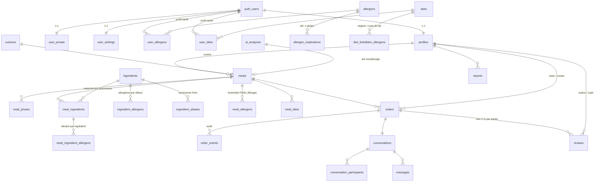
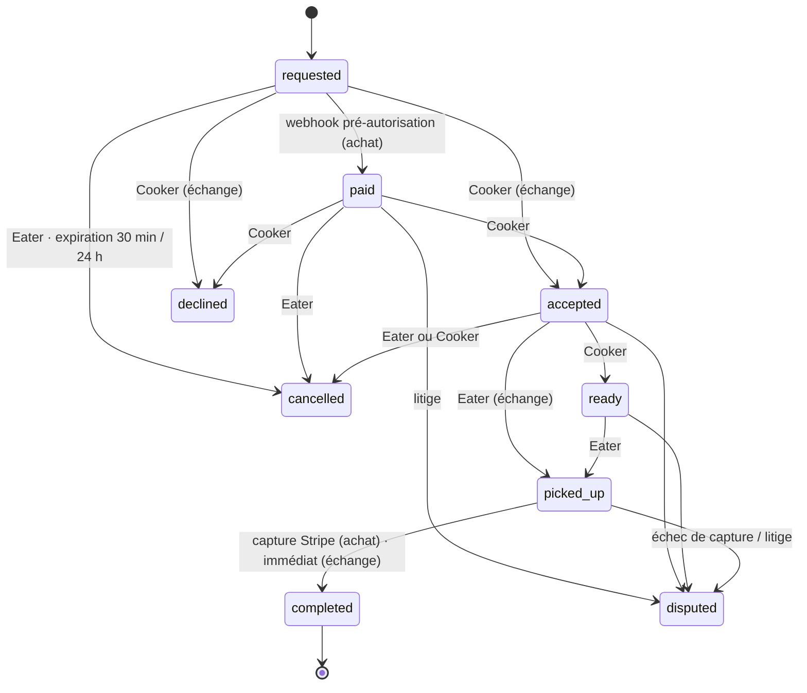

# 2. Schéma de la base de données

Source de vérité : [`supabase/migrations/`](../supabase/migrations). Postgres 15 + PostGIS. Montants en cents (entiers), dates en `timestamptz`, identifiants `uuid`, codes de référence en `text` avec clé étrangère (extensibles sans migration d'enum).

## Diagramme entité-relation



## Domaines

### Référentiels (i18n et expansion internationale)
| Table | Rôle |
|---|---|
| `allergens` | 13 allergènes (priorités Santé Canada + gluten distinct) **+ céleri et lupin** prêts pour l'UE. Colonne `regions` (`{CA,US,EU}`) : chaque marché affiche sa liste réglementaire. Noms FR/EN. |
| `allergen_implications` | Un allergène en entraîne un autre (`wheat → gluten`). Appliqué automatiquement au calcul final. |
| `diets`, `diet_forbidden_allergens` | Régimes et incompatibilités (végane ⇒ ni lait, ni œufs, ni poisson…) — bloquent une déclaration contradictoire. |
| `cuisines` | Types de cuisine (filtre carte/fil). |

### Gestion complexe des ingrédients — le cœur de la sécurité

Trois sources d'allergènes sont **unies** (jamais soustraites) pour produire l'ensemble final d'un plat :

```
meal_allergens(contains) =  ⋃ allergènes déclarés par ingrédient      (meal_ingredient_allergens, validés par le Cooker)
                           ∪ allergènes du dictionnaire curé          (ingredient_allergens, si l'ingrédient est reconnu)
                           ∪ allergènes déclarés hors ingrédient      (suggestion IA conservée, ajout manuel)
                           + implications                              (blé ⇒ gluten)
meal_allergens(may_contain) = traces possibles déclarées (contamination croisée), hors « contains »
```

- `ingredients` : dictionnaire canonique qui grossit avec l'usage. Les entrées **curées** (`is_curated`) portent des allergènes par défaut — c'est le **filet de sécurité** : si un Cooker oublie que le *tahini* contient du sésame ou que la *sauce Worcestershire* contient du poisson, le dictionnaire l'ajoute. Testé dans `supabase/tests/db.test.mjs`.
- `ingredient_aliases` : synonymes normalisés (« tahina », « sesame paste » → tahini) ; rattachement automatique à la publication.
- `meal_ingredients` : liste propre au plat, avec provenance (`ai` / `cooker`) et confiance IA.
- `meal_allergens` : **table dénormalisée recalculée** par `recompute_meal_allergens()`. C'est la seule que lit le moteur de filtrage — une requête simple et indexée (`meal_allergens_code_idx`).

### Profils santé
- `user_allergens(user_id, allergen_code, severity)` — `allergy` ou `intolerance`.
- `user_diets` — régimes à respecter.
- `user_settings.strict_traces` — exclure aussi les « traces possibles » pour les intolérances (toujours exclues pour les allergies).
- `user_private.health_consent_at` — horodatage du consentement (Loi 25 : renseignement de santé = renseignement sensible).

**Moteur de décision** — `meal_is_safe_for(meal, user)` (source de vérité, miroir client dans `src/lib/safety.ts`) :
1. déclaration confirmée par le Cooker (`allergens_confirmed_at`) ;
2. aucun allergène `contains` ∩ profil ;
3. aucune trace ∩ allergie (ou ∩ intolérance si `strict_traces`) ;
4. tous les régimes du profil respectés.

`feed_meals()` applique ce moteur **côté serveur** et renvoie aussi `hidden_for_health` (transparence : « 2 plats masqués pour votre sécurité »).

### Repas
`meals` porte deux points géographiques :
- `pickup_point` — exact, **jamais lisible directement** (privilège de colonne révoqué) ;
- `pickup_point_public` — brouillé de 100 à 300 m, indexé GiST, utilisé par la carte et le calcul de distance.

Contraintes notables : prix obligatoire sauf échange ; fenêtre de disponibilité ≤ 72 h ; **aucun statut visible sans `allergens_confirmed_at` signé par le Cooker** (`meals_published_requires_confirmation`).

### Transactions
- `orders` — un seul modèle pour `purchase` et `swap`. Montants figés à la création : `subtotal`, `service_fee` (payé par l'Eater), `platform_fee` (commission Cooker), `total`.
- Machine d'états dans `transition_order()` (rôle + état vérifiés) et `apply_payment_event()` (événements Stripe, monotones) :



- `order_events` — journal d'audit de chaque transition (acteur, horodatage).
- Stock : achat réservé à la création (verrou `FOR UPDATE`), échange réservé à l'acceptation ; restitution automatique à l'annulation (trigger).

### Réputation bidirectionnelle
- `reviews(order_id, author_id, subject_id, role, rating, sub_scores, tags, comment, visible_at)`.
  - `role` = rôle de la personne **notée** (`cooker` ou `eater`) : un même utilisateur a **deux réputations distinctes**.
  - `sub_scores` : Cooker → goût, hygiène & emballage, conformité à l'annonce, ponctualité ; Eater → ponctualité, communication, respect.
  - **Double-aveugle** : `visible_at` reste nul jusqu'à ce que les deux parties aient noté (ou 7 jours, via cron). Personne ne note « en représailles ».
- Agrégats sur `profiles` (`cooker_rating_avg/count`, `eater_rating_avg/count`) recalculés **uniquement à partir des avis visibles**, jamais modifiables par l'utilisateur.
- Tri « mieux notés » par **moyenne bayésienne** `(moy × n + 4,5 × 5) / (n + 5)` : un 5★ sur 1 avis ne dépasse pas un 4,9★ sur 200.
- Badges calculés (`Top Cooker` ≥ 4,8 sur ≥ 20 avis, `Hygiène certifiée`, `Zéro gaspi` ≥ 25 repas partagés).

### Messagerie
`conversations` (1 par commande) · `conversation_participants` (+ `last_read_at` pour les non-lus) · `messages` (`text` ou `system`). Insertion autorisée par RLS seulement pour un participant, en son nom, de type `text` ; les messages système sont écrits par les triggers de commande.

### Confiance & conformité
- `reports` — motifs typés ; `allergen_incident` et `hygiene` **suspendent le plat immédiatement**.
- `ai_analyses` — journal de chaque analyse (modèle, version du prompt, latence, jetons, résultat) + `validation_diff` (faux positifs / faux négatifs par rapport à la validation humaine). C'est le jeu d'évaluation vivant de l'IA.
- `stripe_events` — idempotence des webhooks.

### Bêta fermée (migration `20260929000100_beta.sql`)
- `app_config` — réglages serveur. `invite_required` (défaut **vrai**, fail-closed) : l'inscription exige un code.
- `beta_invites` — codes d'invitation (`max_uses`, `uses`, `expires_at`, `created_by`). Le trigger `handle_new_user` **consomme le code dans la même transaction** que la création du compte ; code absent, inconnu, expiré ou épuisé ⇒ inscription refusée (`INVITE_CODE_INVALID`). Chaque membre obtient un code personnel de 5 invitations (`my_invite_code`). Illisible par les clients.
- `beta_feedback` — commentaires des testeurs (bogue, idée…), insertion en son nom uniquement (RLS).
- `ai_analyses.task` — `meal` (photo du plat) ou `ocr` (lecture d'étiquette / de recette).

## RPC exposées à l'app

| Fonction | Usage |
|---|---|
| `feed_meals(lat, lng, radius_m, cuisines, diets, max_price, mode, sort, limit)` | Fil + carte, filtré santé, trié, paginé |
| `get_meal(id)` | Détail |
| `get_health_profile()` / `set_health_profile(allergens, diets, strict_traces)` | Profil santé |
| `publish_meal(payload)` | Publication atomique avec attestation |
| `propose_swap(meal, offered_meal, message)` | Échange (sécurité bidirectionnelle) |
| `transition_order(order, to, reason)` | Machine d'états (via Edge `order-action`) |
| `submit_review(order, rating, comment, tags, sub_scores)` | Avis double-aveugle |
| `get_reviews_for_user(user, role, limit)` | Avis visibles |
| `my_conversations()` / `mark_conversation_read(id)` | Messagerie |
| `get_pickup_details(order)` | Adresse exacte (parties d'une commande acceptée) |
| `invite_status(code)` *(aussi `anon`)* | Code d'invitation valide ? invitation exigée ? |
| `my_invite_code()` | Code personnel (créé à la demande, 5 invitations) |
| `session_bootstrap()` | À l'ouverture de session : profil santé, onboardé, compte supprimé |
| `my_meals()` / `withdraw_meal(id)` | Espace Cooker : mes annonces, retrait (refusé si commande/échange accepté en cours) |
| `export_my_data()` / `delete_my_account()` | Loi 25 : copie des données, suppression (profil anonymisé, santé effacée, annonces retirées ; refusée si commande payante en cours) |

Réservées au *service role* : `create_purchase_order`, `apply_payment_event`, `meal_is_safe_for`, `expire_meals`, `reveal_stale_reviews`, `cancel_stale_orders`.

## Tests

```bash
npm run test:db
```
Exécute toutes les migrations + le seed sur un vrai Postgres (PGlite + PostGIS, sans Docker) puis un scénario de bout en bout : filet de sécurité du dictionnaire, implications, validations bloquantes, filtrage du fil, commande complète avec audit, avis double-aveugle, sécurité bidirectionnelle des échanges, suspension sur incident, privilèges de colonnes et de fonctions, et pour la bêta : codes d'invitation (valide, inconnu, épuisé, expiré, personnel, inscriptions ouvertes), état de session, retrait d'annonce, commentaires, export et suppression de compte.
