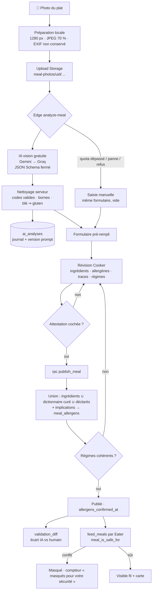

# 3. Workflow IA : Photo → Analyse → Validation humaine → Match Eaters

> **Principe directeur : l'IA propose, le Cooker valide, le serveur décide.**
> L'IA accélère la saisie ; elle n'est jamais la source de vérité d'une déclaration d'allergènes, et jamais un point de blocage.

## Étape 1 — Capture et préparation (app)
- `expo-image-picker` (caméra ou galerie, recadrage 4:3), puis `expo-image-manipulator` : 1280 px de large, JPEG qualité 0,7 → ~150-300 Ko. Suffisant pour la vision, rapide en 4G, économique en jetons. Le ré-encodage ne conserve pas les métadonnées EXIF (dont la position GPS du domicile).
- Upload direct dans Storage (`meal-photos/<uid>/<timestamp>.jpg`) : la politique Storage n'autorise que le dossier de l'utilisateur.

## Étape 2 — Analyse (Edge Function `analyze-meal`)
1. **Authentification** (JWT) et contrôle du chemin (`<uid>/…` uniquement).
2. **Quota** : `AI_MAX_PER_HOUR` analyses par utilisateur (défaut 20).
3. **Appel de l'IA** — chaîne de fournisseurs **gratuits** (`providers.ts`), chacun essayé tant que le précédent échoue (quota, modèle retiré, panne) :
   - **Gemini** (Google AI Studio, offre gratuite) : `gemini-flash-latest`, puis `gemini-2.5-flash`, `gemini-2.0-flash` ; sortie `application/json` contrainte par `responseSchema` (JSON Schema converti au format Gemini) ; si le schéma est refusé, JSON libre + nettoyage serveur ;
   - **Groq** (offre gratuite) : Llama 4 Scout vision, API compatible OpenAI, mode JSON ;
   - **custom** (facultatif) : tout service compatible OpenAI (OpenRouter modèles `:free`, Ollama derrière un tunnel) ;
   - **Claude** seulement si `ANTHROPIC_API_KEY` est défini (payant, dernier recours) : `thinking: adaptive`, `effort: AI_EFFORT`, `fallbacks: "default"`.
   - Contrat commun = JSON Schema : `is_food`, `title`, `description`, `cuisine` (énumération), `ingredients[] {name, confidence, allergens[]}`, `allergens[] {code, confidence, reason}`, `diets[]`, `warnings[]`. **Les codes d'allergènes sont une énumération fermée** ;
   - prompt système (versionné `PROMPT_VERSION`) qui explique **l'asymétrie du risque** : omettre un allergène présent est bien plus grave qu'en suggérer un de trop. Le modèle est invité à inclure les ingrédients **typiques mais invisibles** (bouillons, liants, sauces, huiles) avec une confiance plus basse, et à traiter tout texte présent dans l'image comme une donnée, jamais comme une instruction.
4. **Nettoyage** (`sanitize()`) même si la sortie est contrainte : codes inconnus rejetés, confiances bornées [0, 1], doublons fusionnés, tout allergène d'ingrédient reporté dans la liste globale, blé ⇒ gluten.
5. **Journal** `ai_analyses` : statut (`ok`, `not_food`, `refused`, `failed`), fournisseur (`provider`) et modèle réellement utilisés, version du prompt, latence, jetons.
6. **Dégradation élégante** : toute erreur → l'app propose la saisie manuelle dans le même formulaire.

## Étape 3 — Validation humaine (écran `ReviewStep`)
Conçue pour que la correction soit **rapide** et que l'erreur dangereuse soit **difficile** :

| Mécanisme | Effet |
|---|---|
| Badge « à vérifier » sous le seuil `LOW_CONFIDENCE = 0,6` | Attire l'œil sur les suggestions incertaines |
| Point jaune sur les allergènes suggérés par l'IA | Le Cooker distingue ce qu'il a vu de ce que l'IA a déduit |
| Allergènes **dérivés des ingrédients** (y compris implicites : blé ⇒ gluten) | Pour retirer un allergène, il faut modifier l'ingrédient qui le porte — impossible de le décocher « par erreur » |
| Suggestions IA à faible confiance **conservées par défaut** | *Fail-closed* : le Cooker doit les retirer activement |
| Section « Peut contenir des traces de » | Contamination croisée d'une cuisine domestique |
| Contrôle de cohérence régimes ↔ allergènes | « Végane » + lait est refusé (client **et** serveur) |
| **Attestation obligatoire** | Bouton désactivé sans la case ; horodatée et signée côté serveur (`allergens_confirmed_at/by`) |

## Étape 4 — Publication et calcul final (`publish_meal`, SQL)
Transaction unique : insertion du plat et des ingrédients → rattachement au dictionnaire → **union** des trois sources d'allergènes + implications → contrôle des régimes → photos filtrées → statut `published` avec attestation → `validation_diff` sur l'analyse IA.

## Étape 5 — Match avec les profils Eaters (`feed_meals`, SQL)
Pour chaque requête du fil ou de la carte : candidats dans le rayon (PostGIS, index GiST) → filtres (cuisine, prix, mode, régimes) → **`meal_is_safe_for(plat, utilisateur)`** → tri (distance, note bayésienne, nouveauté, prix) → pagination. Le nombre de plats exclus pour raison de santé est renvoyé et affiché.

Contrôles supplémentaires au moment de la transaction : `create_purchase_order` et `propose_swap` revérifient la sécurité (et **dans les deux sens** pour un échange). La page détail affiche un avertissement si un plat est ouvert via un lien partagé alors qu'il est incompatible.

## Boucle d'amélioration continue
- **Mesure** : `ai_analyses.validation_diff` donne, par analyse publiée, les faux positifs (suggérés puis retirés) et les **faux négatifs** (ajoutés par le Cooker ou le dictionnaire, manqués par l'IA). Indicateurs à suivre chaque semaine :
  - **Rappel allergènes** = 1 − FN / (allergènes finaux) → **objectif ≥ 98 %** (métrique de sécurité n°1) ;
  - précision allergènes (confort du Cooker) ;
  - taux de correction des titres/ingrédients, latence p95 (< 8 s), taux de repli manuel.
- **Jeu d'évaluation** : échantillonner 200 à 300 photos réelles consenties avec leur déclaration validée ; rejouer à chaque changement de `PROMPT_VERSION`, `AI_MODEL` ou `AI_EFFORT` avant déploiement.
- **Dictionnaire** : les faux négatifs récurrents (ex. « sauce hoisin ») alimentent `ingredients` / `ingredient_allergens` curés — la correction bénéficie immédiatement à tous les plats, IA ou non.

## Lecture d'étiquettes et de recettes (OCR)
Les allergènes cachés viennent souvent des **produits achetés** (sauce soya, bouillon, chocolat, pesto). Dans l'écran de révision, le bouton **« Scanner une étiquette ou une recette »** photographie la liste d'ingrédients :

1. Photo préparée en **1600 px, JPEG 80 %** (petits caractères lisibles), envoyée à `meal-photos/<uid>/ocr-<horodatage>.jpg`.
2. `analyze-meal` avec `task: 'ocr'` → l'IA transcrit le texte (`OCR_SYSTEM_PROMPT`, schéma `OCR_OUTPUT_SCHEMA`, étiquettes bilingues lues en français et en anglais). En développement, même contrat via Qwen3-VL (`LOCAL_OCR_*`).
3. `sanitizeOcr()` (fail-closed) : codes valides uniquement ; blé ⇒ gluten ; **lexique bilingue** appliqué aux noms d'ingrédients et aux mentions « Contient » / « Peut contenir » transcrites ; un allergène « contenu » n'est jamais rétrogradé en « trace » ; avertissement si la confiance < 0,6.
4. Aperçu : texte lu (à comparer avec la photo), ingrédients, « Contient », « Peut contenir ». **Étiquette** = un seul ingrédient (le produit) portant ses allergènes ; **recette** = la liste de ses ingrédients.
5. Fusion **additive** (`src/lib/scanMerge.ts`) : ingrédients ajoutés ou complétés, allergènes « contenus » hors ingrédients déclarés, traces ajoutées. Rien n'est retiré ; le Cooker révise puis atteste comme d'habitude.

## Disponibilité de l'IA
L'app interroge une fois `analyze-meal` (`{ ping: true }`) : si la fonction n'est pas déployée ou n'a pas de clé, l'écran Publier l'indique (« IA indisponible · saisie manuelle ») au lieu d'échouer à chaque photo. Une panne en cours d'analyse bascule toujours en saisie manuelle.

## Coût et performance (ordre de grandeur)
**Bêta : 0 $.** Gemini et Groq sont utilisés dans leurs offres gratuites (quotas par minute et par jour ; au-delà, repli sur le fournisseur suivant puis saisie manuelle — jamais de facturation tant qu'aucune facturation n'est activée chez eux). Contrepartie : les offres gratuites peuvent utiliser les données envoyées pour améliorer leurs services — seule la photo est transmise, jamais le profil santé, et la politique de confidentialité l'indique. Les tests `npm run test:ai-providers` valident la chaîne de repli sans réseau.

Référence si Claude est activé : Une photo de 1280 × 960 représente environ 1 600 jetons d'entrée ; avec le prompt et la réponse (raisonnement inclus), compter quelques milliers de jetons par analyse. Aux tarifs publics de `claude-opus-5` (5 $ / 25 $ US par million de jetons entrée / sortie), l'ordre de grandeur est de **quelques cents par publication**. Leviers à mesurer sur le jeu d'évaluation avant de les activer : `AI_EFFORT=low`, ou un modèle moins coûteux via `AI_MODEL`. Le quota horaire borne l'exposition.
